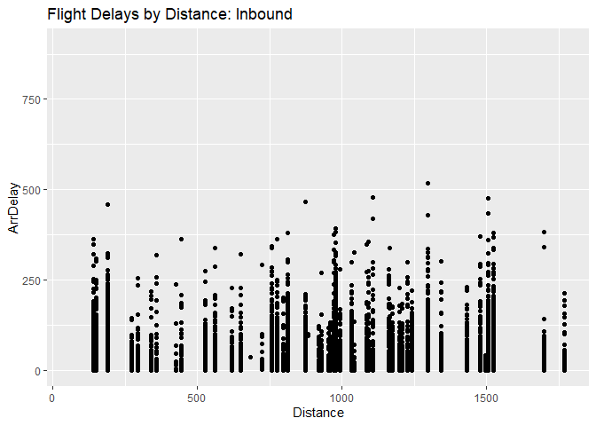
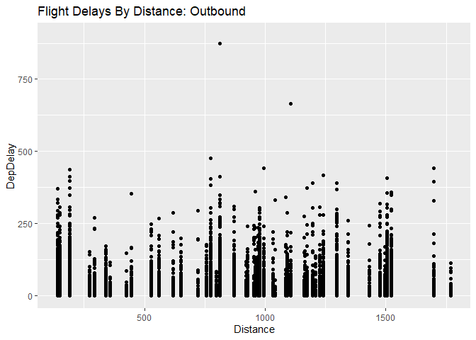
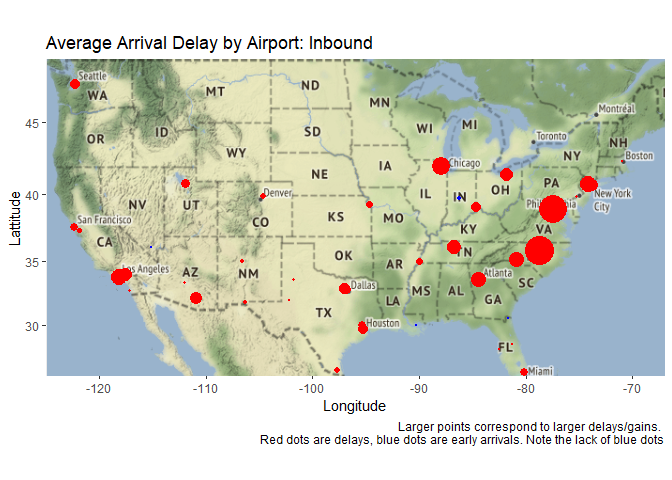
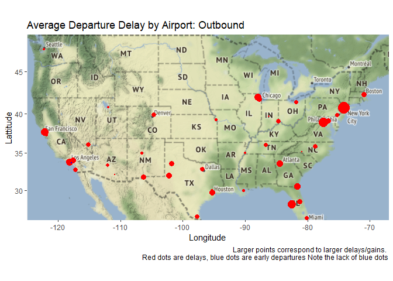
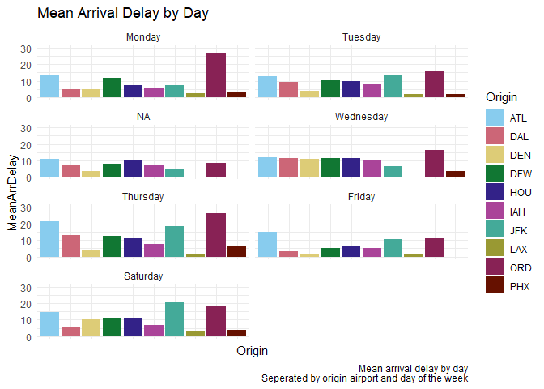
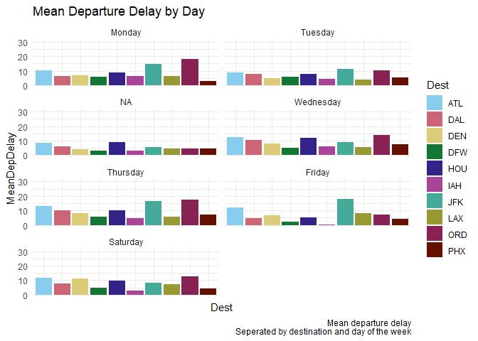
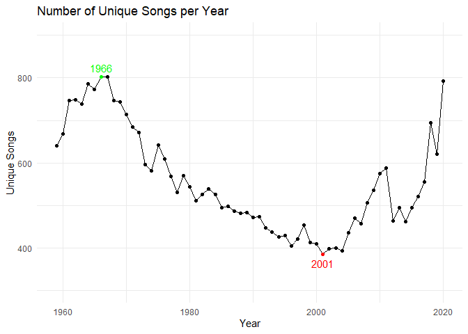
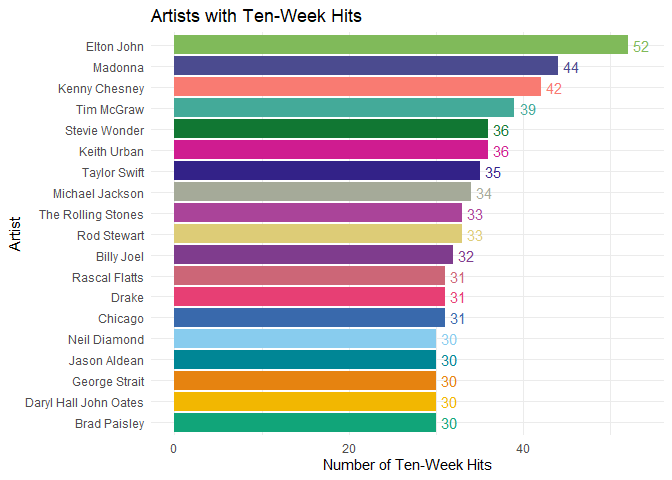

# Question 1

    #Libraries used for various plots
    library(tidyverse) #for wrangling
    library(mosaic) #for wrangling
    library(ggplot2) #for plotting
    library(ggthemes) #to make things pretty
    library(ggmap) #for the map
    library(ggrepel) #to format labels on plots

## Key Question

The key question here is twofold: first, do flights across the US tend
to be delayed by distance or on an airport-by-airport basis. Based on
that result, we also want an idea of what the best day of the week is to
fly.

## Methods and Figures Pt. 1

The answer to the first questions becomes fairly obvious when checking
two different graphs. First, we can simply plot the distance and
expected delays from incoming and outgoing flights

    #Step one, a scatter plot of the distances
    #Start by filtering our data into inbound and outbound sets by filtering on origin/destination
    ABIA_In_ByFlight =  ABIA %>%
      filter(Dest == 'AUS')

    ABIA_Out_ByFlight =  ABIA %>%
      filter(Origin == 'AUS')

    In_DistPlot = ggplot(data=ABIA_In_ByFlight) +
      geom_point(mapping=aes(Distance, ArrDelay)) +
      ylim(0, 900) +
      InDistPlot_Labs
    In_DistPlot

    Out_DistPlot = ggplot(data=ABIA_Out_ByFlight) +
      geom_point(mapping=aes(Distance, DepDelay)) +
      ylim(0, 900) +
      OutDistPlot_Labs
    Out_DistPlot

To do an eyeball test of the airport-dependency of delays, we can map
the delays to the US

    AirportCodes_Filtered = AirportCodes %>%
      #Our one big filter, this gives us only those airports in the US
      #Who have valid IATA codes and are still open (closed airports overlap codes with open ones in some cases)
      filter(iata_code != "", iso_country == "US", type != "closed") %>% #First task
      #Separate region into country/state (country dropped later)
      separate(iso_region, c("Country", "State"), "-", remove=TRUE) %>%
      #Separate coords into long/lat for ggmap to use later
      separate(coordinates, c("Long", "Lat"), ", ") %>%
      mutate(Name = name, Code = iata_code, #renaming these columns for styling
             Long = as.numeric(Long), Lat = as.numeric(Lat)) %>% 
      select(Name, Code, State, Long, Lat) %>%
      arrange(Code)

    #Generating ABIA_In_ByPort by filtering on destinations that are Austin
    #After grouping by the origin, we generate Count and average delay times
    #Following that, we merge the airport codes with their long/lat
    #We drop airports with fewer than 100 flights just to keep things reasonable
    #And get rid of a some missing data errors
    #We then merge it with the airport codes from above
    #This leaves us with a list of all airports that fly into Austin, the number of flights they send, their mean delays
    #and a Long/Lat for each that we can put on a map
    ABIA_In_ByPort =  ABIA %>%
      filter(Dest == 'AUS') %>%
      group_by(Origin) %>%
      summarize(Count = n(), MeanArrDelay = mean(ArrDelay, na.rm=TRUE)) %>% #na.rm == TRUE covers some missing data points here. This is used consistently throughout the rest of the code.
      filter(Count>=100) %>%
      arrange(desc(MeanArrDelay)) %>%
      merge(AirportCodes_Filtered, by.x="Origin", by.y="Code")

    #We generate some info about the destinations in the same way that we do _In
    #The only differences is that Origin == Austin and arrivals become departures
    ABIA_Out_ByPort = ABIA %>%
      filter(Origin == 'AUS') %>%
      group_by(Dest) %>%
      summarize(Count = n(), MeanDepDelay = mean(DepDelay, na.rm=TRUE)) %>%
      filter(Count>=100) %>%
      arrange(desc(MeanDepDelay)) %>%
      merge(AirportCodes_Filtered, by.x="Dest", by.y="Code")

    #Plotting the in and outbound maps
    #color based on positive or negative delays (positive is bad)
    #Size is based on average time (scaled for readability)
    Inbound_MapPlot = ggmap(USMap) +
      geom_point(aes(x=Lat, y=Long),
                 color=ifelse(ABIA_In_ByPort$MeanArrDelay>0, yes="red", no="blue"),
                 size=abs(ABIA_In_ByPort$MeanArrDelay/3), data=ABIA_In_ByPort) +
      InboundMap_Labs +
      xlab("Longitude") + ylab("Lattitude")
    Inbound_MapPlot

    Outbound_MapPlot = ggmap(USMap) +
      geom_point(aes(x=Lat, y=Long),
                 color=ifelse(ABIA_Out_ByPort$MeanDepDelay>0, yes="red", no="blue"),
                 size=abs(ABIA_Out_ByPort$MeanDepDelay/3), data=ABIA_Out_ByPort) +
      labs(title = Outbound_Title, caption = Outbound_Caption) +
      xlab("Longitude") + ylab("Lattitude")
    Outbound_MapPlot

## Results Pt. 1

This is a pretty clear indication that the delays based are on a
per-airport basis and not a flight-distance basis. There are certainly
more formal regressions we could run to examine their significance, but
for our purposes here, an eyeball test is more than adequate, if only
because this is extremely intuitive and the purpose of this question was
more to graph things on a map. For more interesting analysis, we can
jump to our second question: Which days are best for each of the largest
airports.

## Methods and Figures Pt. 2

    #Grab a vector for the top 10 most frequented airports in our dataset
    #Filtering to In/Out correctly, then counting, arranging, listing
    #head(10) does a good job of simply grabbing the top. pull() gets the values as a vector so that we can use %in% later
    ABIA_In_Top10Filter = ABIA %>%
      filter(Dest == 'AUS') %>%
      group_by(Origin) %>%
      summarize(Count = n()) %>%
      arrange(desc(Count)) %>%
      head(10) %>%
      pull(Origin)

    ABIA_Out_Top10Filter = ABIA %>%
      filter(Origin == 'AUS') %>%
      group_by(Dest) %>%
      summarize(Count = n()) %>%
      arrange(desc(Count)) %>%
      head(10) %>%
      pull(Dest)

    #This is pretty simple, just grouping each one by day/week and then summarizing
    #We filter by which ones are in the list of top10
    #the flight number and arrival delay. Arrange is superfluous here I think
    #But useful for checking data manually
    ABIA_In_ByDay =  ABIA %>%
      filter(Dest == 'AUS', Origin %in% ABIA_In_Top10Filter) %>%
      group_by(Origin, DayOfWeek) %>%
      summarize(Count = n(), MeanArrDelay = mean(ArrDelay, na.rm=TRUE)) %>%
      arrange(desc(DayOfWeek))

    ABIA_Out_ByDay = ABIA %>%
      filter(Origin == 'AUS', Dest %in% ABIA_Out_Top10Filter) %>%
      group_by(Dest, DayOfWeek) %>%
      summarize(Count=n(), MeanDepDelay = mean(DepDelay, na.rm=TRUE)) %>%
      arrange(desc(DayOfWeek))

    #Finally, to the plots. Straightforward facetted graphs here, but with some themes and manual coloring to make them look nicer.
    #We also manually set the y-scale so that they match.
    #If you are wondering where ColorSet and _Labs are set, it is above in the un-included section
    #The X axis text is stripped here because in PDF view it is impossible to make it not cluttered.
    #Thankfully, color coord comes in handy in the legend
    InByDay_Plot = ggplot(data = ABIA_In_ByDay) +
      geom_col(mapping = aes(Origin, MeanArrDelay, fill=Origin)) +
      scale_fill_manual(values = ColorSet10) +
      theme_minimal() +
      facet_wrap(~DayOfWeek, nrow=5, labeller=labeller(DayOfWeek = Day_Labs)) +
      ylim(0, 30) +
      InByDay_Labs +
      theme(axis.text.x = element_blank())
    InByDay_Plot

    OutByDay_Plot = ggplot(data = ABIA_Out_ByDay) +
      geom_col(mapping = aes(Dest, MeanDepDelay, fill=Dest)) +
      scale_fill_manual(values = ColorSet10) +
      theme_minimal() +
      facet_wrap(~DayOfWeek, nrow=5, labeller=labeller(DayOfWeek = Day_Labs))+
      ylim(0, 30) +
      OutByDay_Labs +
      theme(axis.text.x = element_blank())
    OutByDay_Plot  

And, in addition to the plots, a we can manually find the best day for
each:

    #Top 10 origin airports and their least-delayed day on average, starting with 1=Monday")
    #-------------------------------------------------------------------------------------")
    ABIA_In_ByDay %>% group_by(Origin) %>% slice_min(MeanArrDelay, n=1) %>% arrange(desc(Count)) %>% head(10)

    ## # A tibble: 10 x 4
    ## # Groups:   Origin [10]
    ##    Origin DayOfWeek Count MeanArrDelay
    ##    <chr>      <int> <int>        <dbl>
    ##  1 DFW            6   728        5.12 
    ##  2 IAH            6   408        5.18 
    ##  3 DAL            6   404        3.42 
    ##  4 DEN            6   371        1.61 
    ##  5 ORD            3   363        8.60 
    ##  6 ATL            3   327       11.0  
    ##  7 PHX            6   307       -0.756
    ##  8 LAX            3   256       -0.727
    ##  9 HOU            6   212        5.93 
    ## 10 JFK            3   194        4.33

    #Top 10 destination airports and their least-delayed day on average, starting with 1=Monday")
    #-------------------------------------------------------------------------------------")
    ABIA_Out_ByDay %>% group_by(Dest) %>% slice_min(MeanDepDelay, n=1) %>% arrange(desc(Count)) %>% head(10)

    ## # A tibble: 10 x 4
    ## # Groups:   Dest [10]
    ##    Dest  DayOfWeek Count MeanDepDelay
    ##    <chr>     <int> <int>        <dbl>
    ##  1 DFW           6   721        2.07 
    ##  2 PHX           1   414        2.94 
    ##  3 DAL           6   399        4.76 
    ##  4 IAH           6   395        0.506
    ##  5 DEN           3   394        4.23 
    ##  6 ORD           3   355        4.74 
    ##  7 ATL           3   329        8.55 
    ##  8 LAX           2   258        4.04 
    ##  9 HOU           6   213        5.11 
    ## 10 JFK           3   195        5.47

## Results Pt. 2

From the above, we can clearly see the best days to fly into or out of
each of these airports. DFW, which is the most trafficked airport for
Austin, is best flown from and to on a Saturday whereas Pheonix should
be flown from on Saturday, but flown to on a Monday.

# Question 2

These questions lack writeups since the only thing requested was a
series of charts. ## Part A

    #Generating a chart of the top 10 songs since 1958, by week on the chart
    Billboard %>% 
      group_by(song, performer) %>% 
      summarize(Count = n()) %>% 
      arrange(desc(Count)) %>% 
      head(10)

    ## # A tibble: 10 x 3
    ## # Groups:   song [10]
    ##    song                                performer                           Count
    ##    <chr>                               <chr>                               <int>
    ##  1 Radioactive                         Imagine Dragons                        87
    ##  2 Sail                                AWOLNATION                             79
    ##  3 Blinding Lights                     The Weeknd                             76
    ##  4 I'm Yours                           Jason Mraz                             76
    ##  5 How Do I Live                       LeAnn Rimes                            69
    ##  6 Counting Stars                      OneRepublic                            68
    ##  7 Party Rock Anthem                   LMFAO Featuring Lauren Bennett & G~    68
    ##  8 Foolish Games/You Were Meant For Me Jewel                                  65
    ##  9 Rolling In The Deep                 Adele                                  65
    ## 10 Before He Cheats                    Carrie Underwood                       64

## Part B

    Billboard_YearDiversity = Billboard %>%
      filter(year != 1958, year != 2021) %>% #drop end years
      select(song, year) %>% #isolate the only columns we care about so unique() is easy
      unique() %>% #delete duplicates
      group_by(year) %>% #collapse to years
      summarize(UniqueSongs = n()) %>% #count the occurrences
      #Adding some variables to use in coloring later; this sets a variable call MaxMin to 1 for the minimum, 2 for the maximum, 0 otherwise
      mutate(Bound = ifelse(min(UniqueSongs) == UniqueSongs | (max(UniqueSongs) == UniqueSongs), 1, 0),
             MaxMin = ifelse(Bound == 1 & (max(UniqueSongs) == UniqueSongs), 2, Bound)) %>%
      select(!Bound) #Drop superfluous column

    #This leaves us with a plot that has 2 important values: years and the number of unique songs on their chart
    #There is also a column called MaxMin with the value 1 for the minimum number, 2 for the maximum, and 0 otherwise
    #By using discrete integers, we can filter with > easily later but still use factor(MaxMin) to get it categorically

    #Below, we are going to use the geom_text_repel library to get our text well placed.
    #Some of this is weird and more than a bit overkill
    #The hardest part to read is the nudge_y, where we have to reconstruct our subset because for some reason we cannot
    #Refer to the variables in the table within the ifelse. This is annoying, but not impossible to deal with
    Billboard_DiversityPlot = ggplot(data = Billboard_YearDiversity, 
                                     aes(year, UniqueSongs, label=year)) +
      geom_line() +
      #below this line, we are no longer dealing with requirements for homework, just making things pretty
      geom_point(aes(color=factor(MaxMin))) + #Set the color based on the categorical version of the discrete
      ylim(300, 900) + #Make the plot larger than required to make room for labels
      geom_text_repel(data=subset(Billboard_YearDiversity, MaxMin>0), aes(color=factor(MaxMin)), 
                      point.padding = 0.5, 
                      nudge_y = ifelse(subset(Billboard_YearDiversity, MaxMin>0)$UniqueSongs>600, 10, -10)) +
      scale_color_manual(values = c("black", "red", "green")) +
      theme_minimal() +
      theme(legend.position = "none") + #delete the legend because it is unnecessary
      ggtitle(label = "Number of Unique Songs per Year") + 
      xlab("Year") + 
      ylab("Unique Songs")
    Billboard_DiversityPlot

## Part C

    #Wrangle in two stages
    Billboard_ByTenWeek = Billboard %>%
      group_by(song, performer) %>% #step 1, filter out songs that spent fewer than 10 weeks on the chart
      summarize(WeeksOnChart = n()) %>%
      filter(WeeksOnChart >= 10) %>%
      group_by(performer) %>% #Step 2, filter out artists with fewer than 30 songs in the remaining list
      summarize(TWHNumber = n()) %>%
      filter(TWHNumber >= 30)

    #Setting up our plot to be ordered, highest to lowest, by number of ten-week hits
    Billboard_TenWeekPlot = ggplot(data = Billboard_ByTenWeek, 
                                   aes(fct_reorder(performer, TWHNumber), TWHNumber, fill=performer)) +
      geom_col() +
      #Again, after this line we just want things looking good
      geom_text(aes(label=TWHNumber, color=performer), nudge_y = 1.5) +
      scale_fill_manual(values=ColorSet19) +
      scale_color_manual(values=ColorSet19) +
      theme_minimal() +
      theme(legend.position = "none") + #delete the legend because it is unnecessary
      ggtitle("Artists with Ten-Week Hits")+
      xlab("Artist") +
      ylab("Number of Ten-Week Hits") +
      coord_flip()

    Billboard_TenWeekPlot

