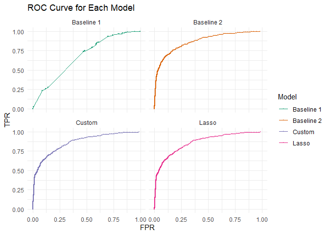
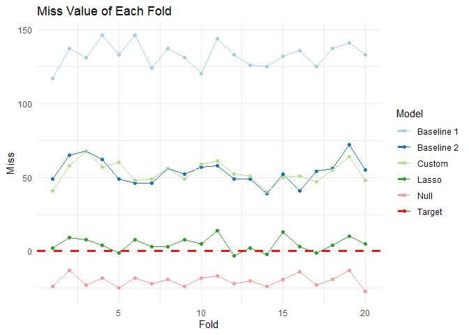

# Problem 1

This figure includes the average boarding rate (in Boarding per 15
minutes) on each hour of day, by day of week (faceted) and month (by
color).The peak boarding time is largely similar on weekdays, with
slight variations; the main notable variation is on Monday boarding in
September,and Wednesday/Thursday/Friday boarding in November. Almost
certainly, this is because of Labor Day, a Monday in September, and
Thanksgiving Break,which runs Wednesday-Sunday in November. Since these
are month long averages, missing one day is a 25% drop in boarding on
that day. The only other wide variation of note is the large drop on
weekends; given this is a campus bus route, reduced traffic on weekends
makes sense.

This figure includes the boarding in a fifteen minute window by
temperature, separated by hour of the day. For the times in the middle
of the day (10:00-17:00) we see some upward trends in the data This
indicates that, if there is truly a trend present, it is going to be
strongest in those hours. At other times of day, the relationship seems
less clear.

# Problem 2

This question hinges off the baseline model built in class which
regresses price on all of the available *except* pctCollege, sewer,
waterfront, landValue, newConstruction. This gives us the coefficients
and out of sample errors (based on an 80/20 train/test split). To ensure
that all of our models produce comparable results, we scale each of the
variables in our model except the outcome, price, and the dummy
variables by two standard deviations: [based on this
paper](https://onlinelibrary.wiley.com/doi/10.1002/sim.3107). Because of
this, the various coefficients have more intuitive relationships to one
another.

<table>
<thead>
<tr class="header">
<th></th>
<th style="text-align: right;">Coefficients</th>
</tr>
</thead>
<tbody>
<tr class="odd">
<td>(Intercept)</td>
<td style="text-align: right;">228246.750</td>
</tr>
<tr class="even">
<td>lotSize</td>
<td style="text-align: right;">15774.144</td>
</tr>
<tr class="odd">
<td>age</td>
<td style="text-align: right;">5069.790</td>
</tr>
<tr class="even">
<td>livingArea</td>
<td style="text-align: right;">118770.475</td>
</tr>
<tr class="odd">
<td>bedrooms</td>
<td style="text-align: right;">-28329.824</td>
</tr>
<tr class="even">
<td>fireplaces</td>
<td style="text-align: right;">2305.778</td>
</tr>
<tr class="odd">
<td>bathrooms</td>
<td style="text-align: right;">30396.109</td>
</tr>
<tr class="even">
<td>rooms</td>
<td style="text-align: right;">11499.460</td>
</tr>
<tr class="odd">
<td>heatinghot water/steam</td>
<td style="text-align: right;">-8265.720</td>
</tr>
<tr class="even">
<td>heatingelectric</td>
<td style="text-align: right;">1702.998</td>
</tr>
<tr class="odd">
<td>fuelelectric</td>
<td style="text-align: right;">-17587.214</td>
</tr>
<tr class="even">
<td>fueloil</td>
<td style="text-align: right;">-17199.442</td>
</tr>
<tr class="odd">
<td>centralAirNo</td>
<td style="text-align: right;">-14993.899</td>
</tr>
</tbody>
</table>

And an RMSE of 6.416515^{4}

### Part A

Generating a linear model that outperforms the baseline model is simple
if you select a model with a cross-validated lasso. This gives us the
coefficients

<table>
<thead>
<tr class="header">
<th></th>
<th style="text-align: right;">Coefficients</th>
</tr>
</thead>
<tbody>
<tr class="odd">
<td>intercept</td>
<td style="text-align: right;">289308.7381</td>
</tr>
<tr class="even">
<td>lotSize</td>
<td style="text-align: right;">9165.7116</td>
</tr>
<tr class="odd">
<td>age</td>
<td style="text-align: right;">-7285.1494</td>
</tr>
<tr class="even">
<td>landValue</td>
<td style="text-align: right;">63462.5558</td>
</tr>
<tr class="odd">
<td>livingArea</td>
<td style="text-align: right;">84885.2219</td>
</tr>
<tr class="even">
<td>pctCollege</td>
<td style="text-align: right;">0.0000</td>
</tr>
<tr class="odd">
<td>bedrooms</td>
<td style="text-align: right;">-7798.3775</td>
</tr>
<tr class="even">
<td>fireplaces</td>
<td style="text-align: right;">337.0963</td>
</tr>
<tr class="odd">
<td>bathrooms</td>
<td style="text-align: right;">29827.5626</td>
</tr>
<tr class="even">
<td>rooms</td>
<td style="text-align: right;">11096.9438</td>
</tr>
<tr class="odd">
<td>heatinghot air</td>
<td style="text-align: right;">8944.4265</td>
</tr>
<tr class="even">
<td>heatinghot water/steam</td>
<td style="text-align: right;">0.0000</td>
</tr>
<tr class="odd">
<td>heatingelectric</td>
<td style="text-align: right;">0.0000</td>
</tr>
<tr class="even">
<td>fuelelectric</td>
<td style="text-align: right;">0.0000</td>
</tr>
<tr class="odd">
<td>fueloil</td>
<td style="text-align: right;">-342.3981</td>
</tr>
<tr class="even">
<td>sewerpublic/commercial</td>
<td style="text-align: right;">0.0000</td>
</tr>
<tr class="odd">
<td>sewernone</td>
<td style="text-align: right;">0.0000</td>
</tr>
<tr class="even">
<td>waterfrontNo</td>
<td style="text-align: right;">-114617.3397</td>
</tr>
<tr class="odd">
<td>newConstructionNo</td>
<td style="text-align: right;">38442.2646</td>
</tr>
<tr class="even">
<td>centralAirNo</td>
<td style="text-align: right;">-9674.9164</td>
</tr>
</tbody>
</table>

This has an RMSE of 5.876774^{4}. This is somewhat incomparable to the
above RMSE for the class model since that RMSE is based on a single
train/test split and this is the result of a 10-fold cross-validation
average. A 10-fold cross-validation average error of the baseline linear
model is 6.609532^{4}. Note that these are based on different folds,
which limits their values but does show that the lasso model is
*clearly* outperforming the baseline.

### Part B

In generating a good KNN model, we (unsurprisingly) do well by
considering all of the non-zero vairables produced by the Lasso model.
Following the standard process of finding the optimal K (and it’s
associated error) through cross validation.

10-fold cross-validated average errors for various values of K

This gives us an optimal K value of 10 which yields an RMSE of
6.135262^{4}. Notably, these are based on the same folds as the baseline
model above, so the values are directly comparable. The net RMSE change
*R**M**S**E**K**N**N* − *R**M**S**E**B**a**s**e**l**i**n**e*=
-4742.7.

### Comparison

Both the lasso and the KNN model are performing better than the baseline
model in class; the only remaining question is which model performs
*best*. In this case, the lasso model is substantially better, with an
RMSE change of
*R**M**S**E**L**a**s**s**o* − *R**M**S**E**K**N**N*=
-2584.88. Our clear and stable performance is then
*R**M**S**E**B**a**s**e**l**i**n**e* &gt; *R**M**S**E**K**N**N* &gt; *R**M**S**E**L**a**s**s**o*.
Of course, this is only one result; to verify that it is stable, we can
simply repeat the same test as above multiple times.

The average RMSE here is given by calculating the RMSE for each of 10
folds of the data (9 in, 1 out) and averaging the ten sets together.
This is repeated 30 times with different folds; each fold is constant
throughout the iteration. This shows clearly the difference between the
models is non-trivial and constant.

# Problem 3

A simple visualization of the data shows some surprising results:

This shows the percentage of loans that defaulted for each given credit
history. This gives a pretty clear idea of the effect of oversampling
defaulted loans on the outcome liklihood.

With a binomial regression we can get an idea of the individual effects
of each variable on the default likelihood. From the regression of
*D**e**f**a**u**l**t* = *β*0 + *β*1*d**u**r**a**t**i**o**n* + *β*2*a**m**o**u**n**t* + *β*3*i**n**s**t**a**l**l**m**e**n**t* + *β*4*a**g**e* + *β*5*h**i**s**t**o**r**y* + *β*6*p**u**r**p**o**s**e* + *β*7*f**o**r**e**i**g**n*
we get obtain the coefficients:

<table>
<thead>
<tr class="header">
<th></th>
<th style="text-align: right;">Coefficients</th>
</tr>
</thead>
<tbody>
<tr class="odd">
<td>Intercept</td>
<td style="text-align: right;">-0.71</td>
</tr>
<tr class="even">
<td>Duration</td>
<td style="text-align: right;">0.03</td>
</tr>
<tr class="odd">
<td>Amount</td>
<td style="text-align: right;">0.00</td>
</tr>
<tr class="even">
<td>Installment</td>
<td style="text-align: right;">0.22</td>
</tr>
<tr class="odd">
<td>Age</td>
<td style="text-align: right;">-0.02</td>
</tr>
<tr class="even">
<td>History: Poor</td>
<td style="text-align: right;">-1.11</td>
</tr>
<tr class="odd">
<td>History: Terrible</td>
<td style="text-align: right;">-1.88</td>
</tr>
<tr class="even">
<td>Purpose: Education</td>
<td style="text-align: right;">0.72</td>
</tr>
<tr class="odd">
<td>Purpose: Goods/Repair</td>
<td style="text-align: right;">0.10</td>
</tr>
<tr class="even">
<td>Purpose: New Car</td>
<td style="text-align: right;">0.85</td>
</tr>
<tr class="odd">
<td>Purpose: Used Car</td>
<td style="text-align: right;">-0.80</td>
</tr>
<tr class="even">
<td>Foreign: No</td>
<td style="text-align: right;">-1.26</td>
</tr>
</tbody>
</table>

Obviously, the interesting point of note is the reduced likelihood to
default given a poor or terrible credit history. This is the inevitable
result of the over sampled defaults in the data set. Since they sample
the defaulted loans then matched them with similar loans, this is
analogous to simply taking a representative sample that included the
desired number of defaults and then dropping a number non-defaulted
loans. This would result in an inflated chance of defaulting for those
groups that have a low rate of default and a relatively deflated chance
for those with better chances of defaulting initially.

# Problem 4

## Model Building

There are four models of interest here; two baseline models that are
given (referred to as baseline 1 and baseline 2) and then a generalized
linear model built with a collection of single variables, no
interactions, that is the result of several iterations of model
building; this model is referred to as “Custom” in all of the figures.
The Custom model also includes two engineered features:
*A**r**r**i**v**a**l**W**D**a**y*, a collection of indicators for the
day of the week of the arrival and an additional indicator,
*A**r**r**i**v**e**d**W**e**e**k**e**n**d* for whether the arrival was
on a Friday or a Saturday. This variable is helpful, presumably because
couples with children are less likely to be travelling during the week
than business travelers. Finally, there is a model generated by a lasso
regression on all single and pairwise interactions, including engineered
features, in the model except for the arrival date; this model is
referred to as “Lasso” in the figures and tables. The lasso model is
notably larger than any of the other models in our set, with 277
coefficients being considered.

Our first goal is to train these models on a standard train/test split
built without using our valuation data. We can generate an accuracy by
calculating the number of correct categorizations over the total
possible answers.

<table>
<thead>
<tr class="header">
<th></th>
<th style="text-align: left;">Accuracy</th>
</tr>
</thead>
<tbody>
<tr class="odd">
<td>Null Model</td>
<td style="text-align: left;">0.9202</td>
</tr>
<tr class="even">
<td>Baseline 1</td>
<td style="text-align: left;">0.9202</td>
</tr>
<tr class="odd">
<td>Baseline 2</td>
<td style="text-align: left;">0.936</td>
</tr>
<tr class="even">
<td>Custom</td>
<td style="text-align: left;">0.9356</td>
</tr>
<tr class="odd">
<td>Lasso</td>
<td style="text-align: left;">0.9292</td>
</tr>
</tbody>
</table>

On this test/train split, the Baseline 2 and the Baseline 1 model are
performing very similarly; this is not surprising since there is very
little difference between the two models. The Baseline 1 model is
performing identically to the null model: at threshold *t* = 0.5 the
Baseline 1 model predicts no children at all, so it is identically the
null. The Lasso is performing slightly worse than the other two model on
the test set, but the difference is small, so it is unclear if this is
due to the lasso not producing a good model in this case, or if the
Custom model is over fit for the train data.

## Model Evaluation Pt. 1

After training and initially evaluating out models, we can begin on our
evaluation data. To pick a functional threshold we can look to the ROC
curves seen in the ROC Curve graph

ROC Curve by Model, FPR is calulated as the rate of incorrect positive
gueses over total true negatives. TPR is the amount of correct positive
guesses over total true positives. Each point represents a different
threshold used for calculation; there are 1000 thresholds evenly
distributed between 0 and 1.

Interestingly, the Baseline 1 produces almost no correct guesses at all,
regardless of the threshold. Each of the points visible on these curves
represents a different threshold value, so in addition to the steep
line, we can clearly see that there are no accurate thresholds. The
other ROC curves are very similar to one another, so choosing a
threshold for this model should not require to many judgment decisions.
In this case, we choose the threshold that gives us the nearest FPR to
0.25 since that seems to be a sound middle ground; this results in a
threshold of 0.0659341. The following results do not substantially
change for a number of thresholds around that choice.

## Model Evaluation Pt. 2

We can then split our valuation data into 20 folds and predict the
number of visits with children for each of those groups, then compare
that to the actual number of visits in each of the groups. By doing this
we can generate a “miss number”, how many children we are off for a
given number of visits.

This gives the number of misses by fold. Misses are calculated as the
predicted number minus the true number of visits with children. A
negative value indicates too few predicted children, a positive number
indicates too many predicted children.

This draws a pretty clear relationship between the models. The Lasso
model is performing extremely well compared to the others, whereas the
Baseline 2 and Custom model, though both are worse than the null model.
The only difference is that they over predict where the null model (by
design) under predicts. The Baseline 1 model substantially worse here
than any other model, including not guessing at all.

The average number of misses for each model. The lasso with pairwise
interactions is clearly the best performer here.

The average miss value tells the clearest story of all; the lasso model
is clearly the best performing of all the models; the other models are
actually worse than simply guessing no children will be present.
