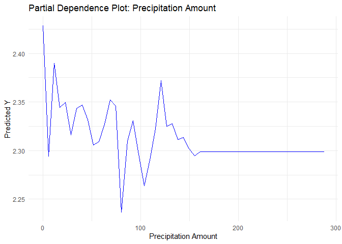

# Question 1

### 1

If you were to simply get data and run a regression of “crime” on
“police” what you would learn is how that data tends to move together
(it’s correlation). This is different from understanding the effect of
one on the other since this a basic regression simply does not make any
claims about cause or direction of effect.

### 2

The researchers at UPenn were able to isolate the effect by noticing
that the number of police in the city was changed *completley
independently* of crime rates whenever the city when on high terror
alert. Because of this, any change in crime was either dependent on
police, or some part of the error term, which provides the researchers
with a wonderful instrumental variable to use in a regression.

### 3

Log(Ridership) was added to the regression as a way to look at the
number of people out and about on those same days. This is to isolate
the effects that these terror alerts may have on the population
(especially tourists) in the city, which may suggest that the crime
rates are also dependent on the terror alert level in the city, which
would correlate the instrument with the error term.

### 4

The model being estimated here is a regression of crime on additional
(unrelated to crime) police presence, seperated by district, controlling
for the number of people in the city. The conclusion is that increases
in police presence that are *independent* of crime will *cause* a drop
in crime; this result is significant at the 1% level.

# Question 2

For these models, we are working with the log-scaled outcomes since they
are somewhat more interperetable than simple case numbers. We will build
two models for our basic tree, one that relies on the given formula:
log(Cases) ~ city + season + specific humidity + average diurnal
temperature range + precipitation. For our second model, we will let the
tree depend on every variable so that we can observe the difference.

The tree view of the given model

The tree view of the wider model. Note here the very slight difference
between the two

When looking at these two trees, the only difference between them is the
decision the third node relies on; in the case of the second tree the
model building substitutes specific humidity with the dew point
temperature. As it turns out, these two variables are very closely
related. We can see that relation in the data:

The relationship between this data is clear to the eye

With that difference being considered, we can see very clearly that the
given formula captures most of the important data. This pattern repeats
itself for future models, which prove relatively unresponsive to feature
engineering. Using the same formula, we can also build a random forest
model and a gradient-boosted model.

-   The basic tree has an RMSE of 1.0365773
-   The random forest model has an RMSE of 0.9780745
-   The gradient-boosted model has an RMSE of 1.0165364

### Partial Dependence Graphs

The partial dependence graphs for the gradient-boosted model, we can see
the various effects of precipitation, humidity, and the season. We can
also investigate the cross-dependence of both precipitation and humidity
with the season. Quick note: The following graphs are not generated in
real time. For some reason, the render engine was not working with
pdp::partial(), so these are built off of cached models that may appear
slightly different than the other analysis indicates. They are still
from identically-built models.

# Question 3

When trying to accurately predict the Revenue per square foot year of an
apartment complex, there are a number of competing models to pick from.

For our basic data preparation and feature engineering, we can take
several simple steps to get a fairly straightforward dataset. It does
not seem important to consider the two energy certifications seperatley;
none of the models we test will have a notable, consistent change in
accuracy by doing this. We also drop all of the observations for which
we have no employment growth data for the Lasso model only. This is not
ideal, for obvious reasons, but is required by some technical
limitations.

We also want to preserve a chunk of data for the last few steps of this
problem as a sanity check, so 20% of our dataset is reserved as a
validation set.

To make the simplest model, we could could assume a linear relationship
between the various features of an apartment, it does make some sense
that each feature would simply add value; there are intuitive and simple
interactions when considering this type of model. We are capable of
building models by hand that perform fairly well. For this basic model
we regress *R**e**v**e**n**u**e**P**e**r**S**q*.*F**t*.*Y**e**a**r* on
*S**i**z**e* + \[*A**g**e*+*R**e**n**o**v**a**t**i**o**n*+*A**g**e*\**R**e**n**o**v**a**t**i**o**n*\] + *C**l**a**s**s**A* + *C**l**a**s**s**B* + *G**r**e**e**n**R**a**t**i**n**g* + \[*N**e**t*+*E**l**e**c**t**r**i**c**i**t**y**C**o**s**t**s*+*G**a**s**C**o**s**t**s*+*E**l**e**c**t**r**i**c**i**t**y**C**o**s**t**s*\**N**e**t*+*G**a**s**C**o**s**t**s*\**N**e**t*+*E**l**e**c**t**r**i**c**i**t**y**C**o**s**t**s*\**G**a**s**C**o**s**t**s*\] + *C**i**t**y**M**a**r**k**e**t**R**e**n**t*.
We can compare this to an alternative, autoselected model from a Lasso
regression in which we allow for all pairwise interactions and find an
RMSE of 11.2912155 for OLS and an RMSE of 9.9248951 for the Lasso
regression. This shows that our linear model is performing pretty well,
though the Lasso is somewhat better in the situation.

There are two non-linear models we can also investigate, a K-nearest
neighbor model and a random forest model. Intuitively, we would expect
the random forest to perform quite well, since most people will choose
where to live based on their desire for a complex combination of
features. For instance, people who desire more space might strongly
value amenities at the margin (or never live somewhere without them) so
the automatic interaction detection inherent in a random forest is of
extreme interest. K-nearest neighbor, however, promises to circumvent
some of that complexity by avoiding interactions in general.

While the random forest model does not need to be tuned, the KNN model
needs to have it’s k selected. Again, searching for stability here, we
can test out a number of K values. When doing this, we do not get a
consistent answer, often 4 is the best choice but on occasion 2 is
slightly better. The biggest confounding fact is that when 2 is bad, it
tends to be *very* bad but 4 is never outside of a single standard
deviation of 2 so we will use K=4 for the rest of our analysis.

You can see that 4 is, by a wide margin, the most often-chosen best
performing K across the models

With four models, we *could* make the decision to stick with the one
that intuitively fits best with our data set, but since our data set is
small and our models are *reasonably* efficient, we can directly
investigate the relationship they have to one another.

To do this, we can build a K-fold of our data set and train each of the
models individually and looks at their error relative to one another. In
order to make sure this is a relationship, we can do this 30 times.

It is obviously clear from this plot that the random forest is the
best-performing model by a wide margin, even though it has the most
variation in it’s performance. If we consider the random forest as the
best model, we can further investigate how it is making the predictions.
Building the model across our entire dataset (instead of averaging the
K-folds) can yield some impressive results. When validating, we are
predicting with an error of 8.8904855

We can also see the importance of each variable

    varImpPlot(GB_RFModel, type=1)

The most surprising factor here is the unimportance of green rating.
This could be due to the marginal nature of this data, since the green
buildings are likely independently valuable for other reasons as well.

The most practically-interesting variables to investigate are the age,
renovation status, city market rent, amenities status, and green rating
status of the buildings. Of these, the most curious is the green rating,
since it does not even consistently make it into the model, much less
does it have a large effect on the potential outcomes. This is the
marginal effect of the rating status, so we cannot say it does not
matter but we can say that it does not seem to make much difference in
the current market.

The other four features of interest *do* consistently make it into the
random forest, and we can investigate their partial dependance graphs
accordingly.

The partial effect on age suggests that, as buildings get older, their
revenue drops.

Renovating a building seems to help some at the margin

Higher market rent is a strong predictor, and obviously rises the
expected returns

Having amenities also seems to increase revenue somewhat

# Question 4

Following with the same logic as the previous question, a random forest
is almost certainly the best choice for a model here. When dealing with
the housing data, anything that can easily observe the complex
interactions between features is something we really want. This model
has one hugely important feature that the previous question did not: 2D
location data that is **not** distributed linearly. For *this*
particular case, we would expect the forest model to enormously
outperform the other models. We can see this clearly by simply building
our model both with and without the longitude and lattitude.

The simple model, which does not have a the houses location, has an OOS
RMSE of 6.779426^{4}. The complex model, which does use the houses
location, has an OOS RMSE of 5.3588719^{4}. The vast differences in the
error is due to the ability of the random forest to make use of the
chaotically-distributed important locations within California.

When we visualize the data, we can see just how important this
information is.

The true distribution of houses shows how there is some physical
clustering that has very little to do with the a linear notion of
location.

The first plot shows the predictions themselves, the second plot shows
the residuals. Note that the scale for predicted value is much smaller
than the scale for true values.

Again, the predictions (left) and the residuals (right) on an identical
scale to the previous graph. Note that these are more accurate in
general, and especially accurate where there are rapid changes in the
true values.

Given the above, we can see both the substantial increase in accuracy
and some evidence as to where that accuracy is found.
