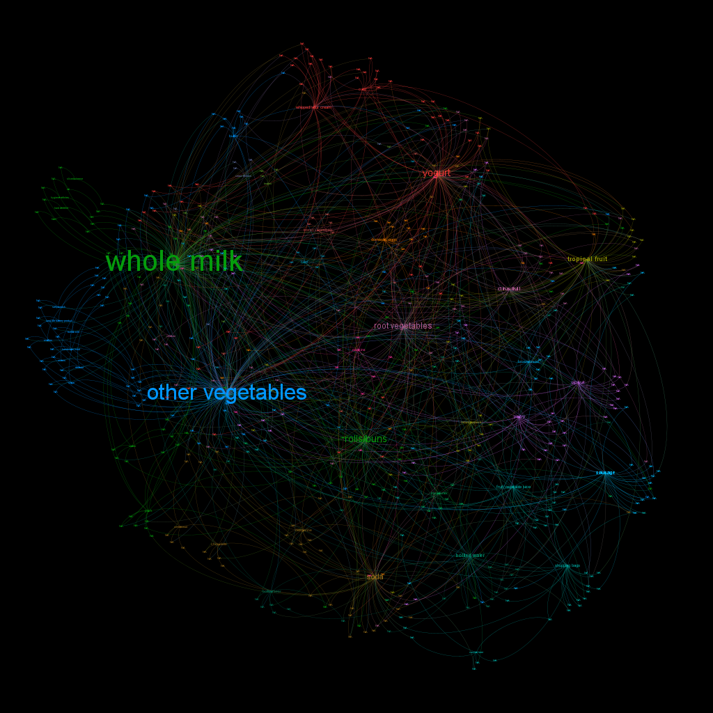
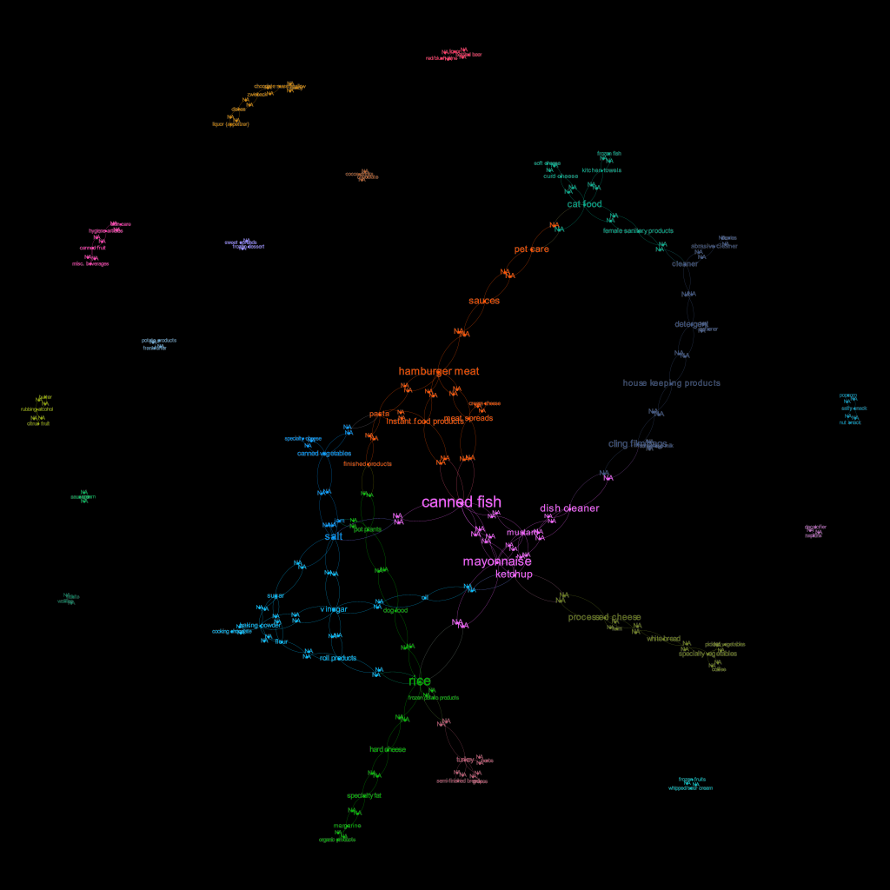

```{r setup, include=FALSE}
#   pdf_document : 
#     extra_dependencies: ["float"]
# knit: (function(inputFile, encoding) {
#   rmarkdown::render(inputFile, output_format = "all") })

knitr::opts_chunk$set(fig.pos = "H", out.extra = "")
knitr::opts_chunk$set(echo = TRUE)
knitr::opts_chunk$set(warning = FALSE, message = FALSE)
```

``` {r Preamble, echo=FALSE}
library(tidyverse) #for wrangling
library(magrittr) #plumbing
library(mosaic) #for wrangling
library(ggplot2) #for plotting
library(ggthemes) #to make things pretty
library(rsample) #for train/test split
library(modelr) #knn
library(foreach) #For loops
library(glue) #paste sucks
library(kableExtra) #more aesthetics
library(RColorBrewer) #Color palettes as lists, which is nice for inter-plot consistency
library(cluster) #for cluster
library(LICORS) #for kmeanspp
library(reshape2) #for melt()
library(arules)
library(arulesViz)
library(igraph)
library(kableExtra)

#Themes and Color Pallettes
theme_set(theme_minimal())
DivColor = brewer.pal(n=7, name="PRGn")
QualColor = brewer.pal(n=5, name="Set1")


```

# Question 1
``` {r Q1Setup, include=F}
Wine = read.csv("wine.csv")

# Goal: set up the best cluster and a PCA on the chemical properties only
# Look at which one allows you to best differentiate the colo and qualities of the wine.
# We are not running a surpervised learning algorithm here, just looking at cluster effects


#Labels only, to join later
Wine_Labels = Wine %>%
  mutate(WineColor = factor(color)) %>% 
  # We rename this and factor it so it is easy to read in subsequent plots
  # Technically unnecessary
  select(c(WineColor, quality))

#We want the label-less, scaled data for clustering
Wine_NoLab_Scaled = Wine %>%
  select(!c(color, quality)) %>%
  scale(center=T, scale=T)
  
#Label-less, centered, unscaled data for PCA
Wine_NoLabel = Wine %>%
  select(!c(color, quality)) %>%
  scale(center=T, scale=F)

# For the gap statistic there are very long run times, so we load a permanently-cached run of it. It is generated by the following
# clusGap(x=Wine_NoLab_Scaled, FUNcluster = kmeans, K.max = 10, B=50, nstart=50) %>% saveRDS("WineGapStat.RDS"))
WineGapStat = readRDS("WineGapStat.RDS")

```

## Clustering
``` {r Clustering, include=F}

#kmpp cluster with k=5
Cluster_Wine = kmeanspp(Wine_NoLab_Scaled, 5, nstart=30)


#merge the ClusterIDs with the labels
Wine_Combined_Cluster = cbind(Wine_Labels, Cluster_Wine$cluster)

#Rename the columns for ease of use
colnames(Wine_Combined_Cluster) <- c("WineColor", "quality", "ClusterID")

```
Using a K calculated by the first local max of the gap statistic (k=5) we can cluster our data reasonable well with Kmeans++. Since the two measures cluster difference that we are interested in are the color and quality of the wine, we can look directly at how these clusters fall.
``` {r ClusterVis, echo=F, fig.cap="It\'s easy to see the separation between Red and White wines here, since the two colors are dominated by about half of the clusters. The relationship between quality and cluster is less than clear"}

Wine_Combined_Cluster %>%
  ggplot() +
  geom_jitter(mapping=aes(WineColor, quality, color=factor(ClusterID))) +
  scale_color_manual(values=QualColor) +
  labs(
    title="Color and Quality, visualized by Cluster",
    x="Wine Color",
    y="Wine Quality",
    color="Cluster ID"
  )

```

``` {r ColorSpread, echo=F, fig.cap="Looking at just the color classifications, clustering seems to be a pretty reliable way to seperate wines"}

Wine_Combined_Cluster %>%
  group_by(ClusterID) %>%
  summarize(WhiteProp = sum(WineColor == "white")/n(),
            Q_Mean = mean(quality), Q_SD = sd(quality)) %>%
  ggplot() +
  geom_col(aes(factor(ClusterID), WhiteProp, fill=factor(ClusterID))) +
  scale_fill_manual(values=QualColor) +
  theme(legend.position="none") +
  labs(
    title="Proportion of Wines in each cluster",
    x="Cluster",
    y="White Wine Proportion"
  )

```
Important to note here is that we do not have even proportions of red and white wine in our sample. The proportion of white wine is `r Wine_Combined_Cluster %>% summarize(sum(WineColor=='white')/n()) %>% pull(1) %>% round(2)` so we want to see the proportion be as far away from that midpoint as possible.

Looking deeper into the quality of each cluster, we struggle to see much difference between them at all.

``` {r QualitySpread, echo=F, fig.cap="The quality spread is much less reliable than the color. It is almost impossible to distinguish between the quality based on the result of the clustering."}

Wine_Combined_Cluster %>%
  ggplot(aes(factor(ClusterID), quality)) +
  geom_boxplot(mapping=aes(color=factor(ClusterID))) +
  scale_color_manual(values=QualColor) +
  theme(legend.position="none") +
  labs(
    title="Wine Quality Distribution by Cluster",
    x="Cluster",
    y="Quality"
  )

```

## PCA
``` {r PCASetup, include=F}
PC_Wine = prcomp(Wine_NoLabel, scale=TRUE, rank=6)
Wine_Loadings = PC_Wine$rotation %>% as.data.frame %>% rownames_to_column("Property")
Wine_Scores = PC_Wine$x %>% as.data.frame

Wine_Combined_PCA = cbind(Wine_Labels, Wine_Scores)
```

``` {r PCAColor, echo=F, fig.cap="You can see very clearly from this graph that PC1 is a good measure of wine color. PC2 is less related."}
Wine_Combined_PCA %>% 
  ggplot() +
  geom_point(mapping = aes(PC1, PC2, color=WineColor)) +
  scale_color_manual(values=c("red", "blue"), labels=c("Red", "White")) +
  labs(
    title = "Color by Principle Components",
    color = "Wine Color"
  )

```

It is unsurprising that PC2 would be less related to wine color, since PC1 draws a clear distinction and PC2 is calculated on the residuals of PC1.

``` {r PCAQual, echo=F, fig.cap="There is not a very clear relationship between PC and quality"}
Wine_Combined_PCA %>% 
  ggplot() +
  geom_point(mapping = aes(PC1, PC2, color=quality)) +
  scale_color_gradient2(low=DivColor[1], mid=DivColor[4], high=DivColor[7],
                        midpoint=6) +
  labs(
    title = "Quality by Principle Components",
    color = "Quality"
  )
```

Though weak, some limited trend does seem to appear on PC2 (and not on PC1).

``` {r PCA2Qual, echo=F, fig.cap="Investigating just PC2, the trend is not particularly clear. Note that jitter is only applied on the Quality axis for clarity; PC2 values are precise."}

Wine_Combined_PCA %>%
  ggplot() +
  geom_jitter(mapping=aes(PC2, quality), width=0, height=0.2, alpha=0.4) +
  labs(
    title="Quality by PC2",
    x="PC2",
    y="Wine Quality"
  )

```

PC2 seems to be largely unrelated to quality ranking, but there may be future PCs that show it more clearly

``` {r PCAMultQual, echo=F, fig.cap="We can view the trends for a number of principle components to see that, in addition to not being particularly clear on PC1 or 2, quality does not seem to be distinguished on any principle component at all, even at excessive numbers of components."}

melt(Wine_Combined_PCA, c("WineColor", "quality")) %>%
  ggplot(mapping=aes(factor(quality), value)) +
  geom_boxplot() +
  facet_wrap(~variable) +
  labs(
    title="Wine Quality by PC for 6 Different Components",
    x="Wine Quality",
    y="Component Value"
  ) +
  coord_flip()

```

## Summary
The two summarization methods both perform exceptionally well when distinguishing between red and white wine, and neither is a strong performer at judging wine quality. The clustering method is likely the better option here, even in absence of simply distinguishing red and white wines. The chemical properties listed are all interrelated; alcohol increases as residual sugar decreases during fermentation, while the starting sugar is mainly determined by the grape type, but alcohol will *also* change the acidity during fermentation, which is mainly determined by vineyard and soil. These inter-relationships would limit the areas of the space that are achievable and would limited the ability of principle components to distinguish between wines since part of it's calculation would be simply capturing those relationships.

If we have additional factors we are trying to distinguish between (such as grape type, vineyard location, etc.) then clustering would intuitively give better distinctions, especially considering that wine is made by bringing flavors within the batch close to a given family, like Merlot or Chardonnay, so the wine creation process is analogous to clustering by taste and would yield a less-continuous result, since middle-ground wines are not often produced.

# Question 2

When investigating the tendencies of twitter users in association with a brand, we can look at the principle components of their post counts to get an idea of how they tend to intersect. There are four components that provide decent insight, which each representing a larger contiguous segment than the last. The scale of each component is in terms of standard deviations from the mean, so a negative value means "less than normal" and a larger value means "more than normal". Below, we see each of the top fifteen factors for each PC in order of magnitude.

```{r, echo=F}

SocMed = read.csv("social_marketing.csv")

# Read these in and drop the names
SocMed %>% select(-X) %>% 
  prcomp(scale=T, rank=4) -> PCA_SocMed #Calculate the PCA and stick it in a variable

# For each PC, we hand sort it to prepare for our lord a kabler
PCA_SocMed$rotation %>% as.data.frame %>% select(PC1) %>% arrange(desc(abs(PC1))) %>% head(10) %>% rownames_to_column(var="Post Type") -> PC1_Sorted
PCA_SocMed$rotation %>% as.data.frame %>% select(PC2) %>% arrange(desc(abs(PC2))) %>% head(10) %>% rownames_to_column(var="Post Type") -> PC2_Sorted
PCA_SocMed$rotation %>% as.data.frame %>% select(PC3) %>% arrange(desc(abs(PC3))) %>% head(10) %>% rownames_to_column(var="Post Type") -> PC3_Sorted
PCA_SocMed$rotation %>% as.data.frame %>% select(PC4) %>% arrange(desc(abs(PC4))) %>% head(10) %>% rownames_to_column(var="Post Type") -> PC4_Sorted

kable(PC1_Sorted)
kable(PC2_Sorted)
kable(PC3_Sorted)
kable(PC4_Sorted)


# kable(list(PC1_Sorted, PC2_Sorted, PC3_Sorted, PC4_Sorted)) %>%
#   add_header_above(header = c("First Principle Compononent"=1, "Second Principle Compononent"=1, "Third Principle Compononent"=1, "Fourth Principle Compononent"=1))

```


The first principle component represents the largest segment of users; most significantly, they are all negatively signed. This means that the most common thing the mass of users share in common are the things they do not post. Given that, the first PC does not contain a huge amount of information beyond the tendency of twitter users to make a lot of self-similar posts. The second PC represents people who are interested in fashion, photo sharing, cooking, health, and personal fitness but do not tend to post religious, sports-related, or family-related posts. This is conducive with active, single (or young) customers. The third PC has a decent intersection, with the biggest difference being the very negative inclusion of politics, travel, and computer related posts and the small but positive inclusion of religious posts. If we, for a moment, investigate just the mean and median of religious posts we can see a (not scaled) mean of `r SocMed %>% pull(religion) %>% mean %>% round(3)` and a median of `r SocMed %>% pull(religion) %>% median %>% round(3)`. Given the sever right skew, it is likely that this slight inclusion in the third principle component represents a substantial preference toward religious posts whereas other groups post *very* few, if any, religious tweets . This amounts to two core groups of physically active, outdoors-focused customers: one group that is socially focused (posting about beauty, fashion, and sharing photos) who *may* be political while the other is definitely not political, but is religious and more likely to have a family, while also being slightly less concerned with popular culture.

The outlying group is represented by the fourth principal component: they are notably less concerned with health and the outdoors than the rest of the consumer base. Additionally, this group is probably college aged (often posting about college), and interested in 'typical' college topics: online gaming, sports playing, photo sharing, and beauty.

# Question 3

When it comes to the placement of items in a grocery store there are two main questions: how should we, generally, organize out store so that customers are able to shop easily and where should we break from that rule to influence more purchases. This first question is one of raw association: if you are buying things, we want to make sure that you know where to buy it and are able to get as many things as possible near to each other. The second question is more complicated; there are two obvious paths: placing items that have a strong relationship with one another even when they have no similar relationships and placing items in such a way that you are more likely to buy that item given it's new placement than you were before. This first goal is achievable here and, by selecting brands with higher profit margins than others, we can increase revenue (i.e. putting name-brand cookies next to milk while all other cookies are in the cookie aisle). The second question is *not* of concern here, since that is a question of change in lift subject to placements and outside the scope of our data.

For the first part: organization of stores. This is a question of centrality given support and confidence of association rules. We are not yet concerned with lift, just in associating items that appear together often and organizing around those.

``` {r GenCode, include=F, eval=F}

# Graphs are generated by the following code

BasketRules_Multi <- read.delim("groceries.txt", header=FALSE) %$%
  strsplit(V1,",") %>%
  lapply(unique) %>%
  #We cast to transactions here, as required by apriori
  as("transactions") %>%
  # Run apriori to get the association rules
  # For this output, we are only concerned with the high support, high confidence rules
  # See writeup for logic
  apriori(parameter=list(support=.01, confidence=.02, maxlen=4, minlen=2)) %>%
  # Get 'em to the Gephi
  saveAsGraph(file = "BasketRules_Multi.graphml")

BasketRules_Single <- read.delim("groceries.txt", header=FALSE) %$%
  strsplit(V1,",") %>%
  lapply(unique) %>%
  #We cast to transactions here, as required by apriori
  as("transactions") %>%
  #run apriori to get the association rules
  apriori(parameter=list(support=.0005, confidence=.001, maxlen=2, minlen=2)) %>%
  # For this one, lift is the key parameter
  # Again, see writeup
  subset(lift>=5) %>%
  # Get 'em to the Gephi
  saveAsGraph(file = "BasketRules_Single.graphml")


```



The staple foods are the unsurprising centers for this organization, whole milk and a medley of vegetables show up near to each other, and are closely related to breads and potatoes/carrots. On the further wings, we have ice cream, yogurt, and tropical fruits gravitating toward whole milk. Fruit juice bridges the gap between fruit, water, and soda, all of which are closer to bread and vegetables than milk. These results are somewhat unsurprising and closely mimic what you would find in any grocery store.

Placing products to defy these conventions is a bit more interesting. This is a question mainly of lift and confidence. In particular, we want to meet a threshold for confidence that ensures our decisions matter while seeking the highest possible lift. 



Looking at these relationships, we can start to see some critical associations. These are the high-lift associations across products and the structure is somewhat interesting. There are a handful of key families that draw paths that can be intuited, such as canned fish being related to mayonnaise (two key ingredients for tuna salad and not for much else) and mayonnaise being closely associated to ketchup, both of which are important for hamburgers. Finally, both of these close pairs are pretty strongly associated with dish cleaner for obvious reasons.

Beyond this core of highly-cross associated chunks, there are 'islands' that represent pairs that don't associated with anything else. Beer/wine/liquor and pretzels/nuts/salty snacks are two islands like this, which represent items that are normally bought in variety and not often paired with much else. If we just list the top few rules, we can see the most valuable items to put together.

``` {r LiftTable, include=F}
LiftTable = read.delim("groceries.txt", header=FALSE) %$%
  strsplit(V1,",") %>%
  lapply(unique) %>%
  #We cast to transactions here, as required by apriori
  as("transactions") %>%
  #run apriori to get the association rules
  apriori(parameter=list(support=.0005, confidence=.001, maxlen=2, minlen=2)) %>%
  # For this one, lift is the key parameter
  # Again, see writeup
  subset(lift>=6) %>%
  DATAFRAME %>%
  filter(row_number() %% 2 == 0)%>%
  select(-coverage, -support, -confidence) %>%
  arrange(desc(lift)) %>%
  head(15) %>%
  mutate_if(is.numeric, round, 2) %>%
  kable(col.names = c("First Item", "Second Item", "Lift", "Count"))

```
``` {r PrintTable, echo=F}
LiftTable
```

This gives a good idea of the strongest associations across the data in terms of lift. Cleaners and abrasive cleaners are a good example of items that would intuitively be grouped, since they are *only* bought together whereas the association between cheese and canned vegetables is possibly less obvious unless you are a frequent consumer of charcuterie boards.