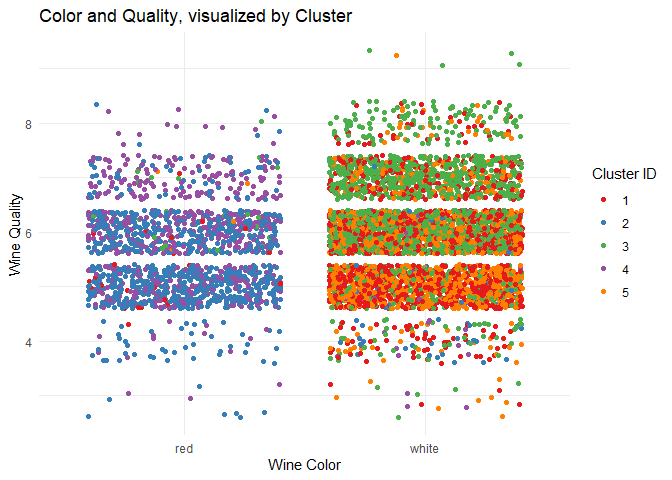
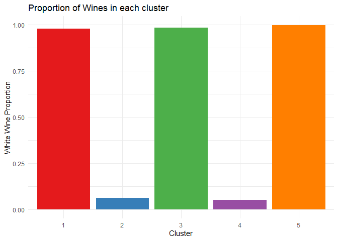
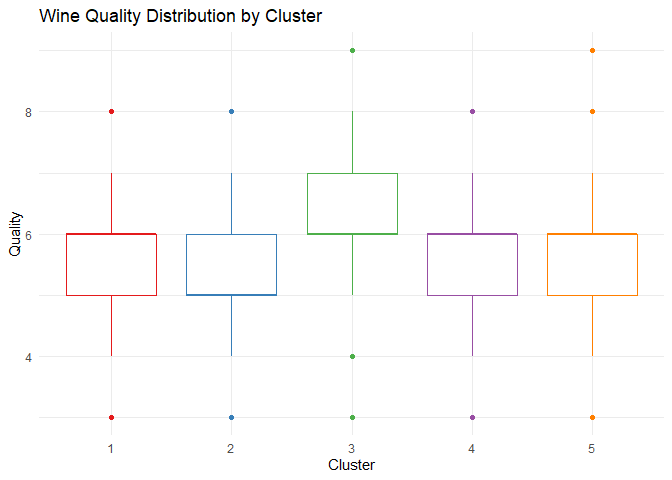
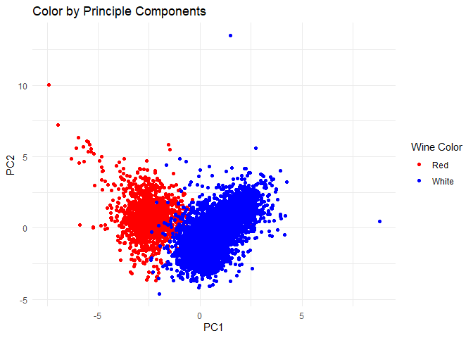
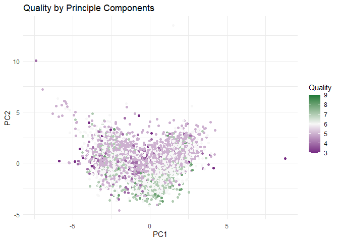
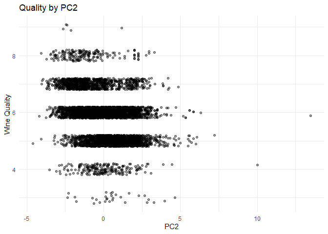
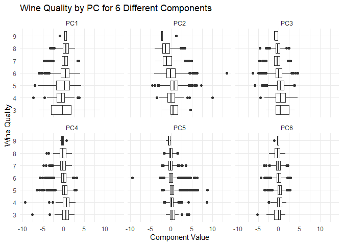

# Question 1

## Clustering

Using a K calculated by the first local max of the gap statistic (k=5)
we can cluster our data reasonable well with Kmeans++. Since the two
measures cluster difference that we are interested in are the color and
quality of the wine, we can look directly at how these clusters fall.

It’s easy to see the separation between Red and White wines here, since
the two colors are dominated by about half of the clusters. The
relationship between quality and cluster is less than clear

Looking at just the color classifications, clustering seems to be a
pretty reliable way to seperate wines

Important to note here is that we do not have even proportions of red
and white wine in our sample. The proportion of white wine is 0.75 so we
want to see the proportion be as far away from that midpoint as
possible.

Looking deeper into the quality of each cluster, we struggle to see much
difference between them at all.

The quality spread is much less reliable than the color. It is almost
impossible to distinguish between the quality based on the result of the
clustering.

## PCA

You can see very clearly from this graph that PC1 is a good measure of
wine color. PC2 is less related.

It is unsurprising that PC2 would be less related to wine color, since
PC1 draws a clear distinction and PC2 is calculated on the residuals of
PC1.

There is not a very clear relationship between PC and quality

Though weak, some limited trend does seem to appear on PC2 (and not on
PC1).

Investigating just PC2, the trend is not particularly clear. Note that
jitter is only applied on the Quality axis for clarity; PC2 values are
precise.

PC2 seems to be largely unrelated to quality ranking, but there may be
future PCs that show it more clearly

We can view the trends for a number of principle components to see that,
in addition to not being particularly clear on PC1 or 2, quality does
not seem to be distinguished on any principle component at all, even at
excessive numbers of components.

## Summary

The two summarization methods both perform exceptionally well when
distinguishing between red and white wine, and neither is a strong
performer at judging wine quality. The clustering method is likely the
better option here, even in absence of simply distinguishing red and
white wines. The chemical properties listed are all interrelated;
alcohol increases as residual sugar decreases during fermentation, while
the starting sugar is mainly determined by the grape type, but alcohol
will *also* change the acidity during fermentation, which is mainly
determined by vineyard and soil. These inter-relationships would limit
the areas of the space that are achievable and would limited the ability
of principle components to distinguish between wines since part of it’s
calculation would be simply capturing those relationships.

If we have additional factors we are trying to distinguish between (such
as grape type, vineyard location, etc.) then clustering would
intuitively give better distinctions, especially considering that wine
is made by bringing flavors within the batch close to a given family,
like Merlot or Chardonnay, so the wine creation process is analogous to
clustering by taste and would yield a less-continuous result, since
middle-ground wines are not often produced.

# Question 2

<table class="table" style="width: auto !important; float: left; margin-right: 10px;">
<thead>
<tr>
<th style="text-align:left;">
Post Type
</th>
<th style="text-align:right;">
Principle Component
</th>
</tr>
</thead>
<tbody>
<tr>
<td style="text-align:left;">
religion
</td>
<td style="text-align:right;">
-0.2971000
</td>
</tr>
<tr>
<td style="text-align:left;">
food
</td>
<td style="text-align:right;">
-0.2969095
</td>
</tr>
<tr>
<td style="text-align:left;">
parenting
</td>
<td style="text-align:right;">
-0.2940041
</td>
</tr>
<tr>
<td style="text-align:left;">
sports\_fandom
</td>
<td style="text-align:right;">
-0.2877318
</td>
</tr>
<tr>
<td style="text-align:left;">
school
</td>
<td style="text-align:right;">
-0.2806379
</td>
</tr>
<tr>
<td style="text-align:left;">
family
</td>
<td style="text-align:right;">
-0.2442687
</td>
</tr>
<tr>
<td style="text-align:left;">
beauty
</td>
<td style="text-align:right;">
-0.2015184
</td>
</tr>
<tr>
<td style="text-align:left;">
crafts
</td>
<td style="text-align:right;">
-0.1936276
</td>
</tr>
<tr>
<td style="text-align:left;">
cooking
</td>
<td style="text-align:right;">
-0.1888085
</td>
</tr>
<tr>
<td style="text-align:left;">
fashion
</td>
<td style="text-align:right;">
-0.1838818
</td>
</tr>
<tr>
<td style="text-align:left;">
photo\_sharing
</td>
<td style="text-align:right;">
-0.1802795
</td>
</tr>
<tr>
<td style="text-align:left;">
eco
</td>
<td style="text-align:right;">
-0.1453356
</td>
</tr>
<tr>
<td style="text-align:left;">
computers
</td>
<td style="text-align:right;">
-0.1433312
</td>
</tr>
<tr>
<td style="text-align:left;">
outdoors
</td>
<td style="text-align:right;">
-0.1426042
</td>
</tr>
<tr>
<td style="text-align:left;">
personal\_fitness
</td>
<td style="text-align:right;">
-0.1375011
</td>
</tr>
<tr>
<td style="text-align:left;">
business
</td>
<td style="text-align:right;">
-0.1350100
</td>
</tr>
<tr>
<td style="text-align:left;">
shopping
</td>
<td style="text-align:right;">
-0.1329950
</td>
</tr>
<tr>
<td style="text-align:left;">
automotive
</td>
<td style="text-align:right;">
-0.1313252
</td>
</tr>
<tr>
<td style="text-align:left;">
politics
</td>
<td style="text-align:right;">
-0.1302662
</td>
</tr>
<tr>
<td style="text-align:left;">
sports\_playing
</td>
<td style="text-align:right;">
-0.1302165
</td>
</tr>
<tr>
<td style="text-align:left;">
news
</td>
<td style="text-align:right;">
-0.1276433
</td>
</tr>
<tr>
<td style="text-align:left;">
chatter
</td>
<td style="text-align:right;">
-0.1259924
</td>
</tr>
<tr>
<td style="text-align:left;">
health\_nutrition
</td>
<td style="text-align:right;">
-0.1242011
</td>
</tr>
<tr>
<td style="text-align:left;">
music
</td>
<td style="text-align:right;">
-0.1240892
</td>
</tr>
<tr>
<td style="text-align:left;">
small\_business
</td>
<td style="text-align:right;">
-0.1190418
</td>
</tr>
<tr>
<td style="text-align:left;">
travel
</td>
<td style="text-align:right;">
-0.1166490
</td>
</tr>
<tr>
<td style="text-align:left;">
home\_and\_garden
</td>
<td style="text-align:right;">
-0.1157650
</td>
</tr>
<tr>
<td style="text-align:left;">
dating
</td>
<td style="text-align:right;">
-0.1051565
</td>
</tr>
<tr>
<td style="text-align:left;">
art
</td>
<td style="text-align:right;">
-0.0979493
</td>
</tr>
<tr>
<td style="text-align:left;">
tv\_film
</td>
<td style="text-align:right;">
-0.0974567
</td>
</tr>
<tr>
<td style="text-align:left;">
current\_events
</td>
<td style="text-align:right;">
-0.0972367
</td>
</tr>
<tr>
<td style="text-align:left;">
uncategorized
</td>
<td style="text-align:right;">
-0.0944351
</td>
</tr>
<tr>
<td style="text-align:left;">
college\_uni
</td>
<td style="text-align:right;">
-0.0941567
</td>
</tr>
<tr>
<td style="text-align:left;">
online\_gaming
</td>
<td style="text-align:right;">
-0.0738898
</td>
</tr>
<tr>
<td style="text-align:left;">
adult
</td>
<td style="text-align:right;">
-0.0267310
</td>
</tr>
<tr>
<td style="text-align:left;">
spam
</td>
<td style="text-align:right;">
-0.0114609
</td>
</tr>
</tbody>
</table>
<table class="table" style="width: auto !important; float: left; margin-right: 10px;">
<thead>
<tr>
<th style="text-align:left;">
rowname
</th>
<th style="text-align:right;">
PC2
</th>
</tr>
</thead>
<tbody>
<tr>
<td style="text-align:left;">
sports\_fandom
</td>
<td style="text-align:right;">
-0.3169236
</td>
</tr>
<tr>
<td style="text-align:left;">
religion
</td>
<td style="text-align:right;">
-0.3161528
</td>
</tr>
<tr>
<td style="text-align:left;">
cooking
</td>
<td style="text-align:right;">
0.3142880
</td>
</tr>
<tr>
<td style="text-align:left;">
photo\_sharing
</td>
<td style="text-align:right;">
0.3030776
</td>
</tr>
<tr>
<td style="text-align:left;">
parenting
</td>
<td style="text-align:right;">
-0.2950822
</td>
</tr>
<tr>
<td style="text-align:left;">
fashion
</td>
<td style="text-align:right;">
0.2797997
</td>
</tr>
<tr>
<td style="text-align:left;">
food
</td>
<td style="text-align:right;">
-0.2378087
</td>
</tr>
<tr>
<td style="text-align:left;">
shopping
</td>
<td style="text-align:right;">
0.2098528
</td>
</tr>
<tr>
<td style="text-align:left;">
beauty
</td>
<td style="text-align:right;">
0.2086099
</td>
</tr>
<tr>
<td style="text-align:left;">
school
</td>
<td style="text-align:right;">
-0.1975724
</td>
</tr>
<tr>
<td style="text-align:left;">
chatter
</td>
<td style="text-align:right;">
0.1972255
</td>
</tr>
<tr>
<td style="text-align:left;">
family
</td>
<td style="text-align:right;">
-0.1962532
</td>
</tr>
<tr>
<td style="text-align:left;">
health\_nutrition
</td>
<td style="text-align:right;">
0.1465778
</td>
</tr>
<tr>
<td style="text-align:left;">
uncategorized
</td>
<td style="text-align:right;">
0.1464989
</td>
</tr>
<tr>
<td style="text-align:left;">
personal\_fitness
</td>
<td style="text-align:right;">
0.1446118
</td>
</tr>
<tr>
<td style="text-align:left;">
music
</td>
<td style="text-align:right;">
0.1442595
</td>
</tr>
<tr>
<td style="text-align:left;">
college\_uni
</td>
<td style="text-align:right;">
0.1159597
</td>
</tr>
<tr>
<td style="text-align:left;">
outdoors
</td>
<td style="text-align:right;">
0.1135818
</td>
</tr>
<tr>
<td style="text-align:left;">
sports\_playing
</td>
<td style="text-align:right;">
0.1085954
</td>
</tr>
<tr>
<td style="text-align:left;">
business
</td>
<td style="text-align:right;">
0.0987826
</td>
</tr>
<tr>
<td style="text-align:left;">
small\_business
</td>
<td style="text-align:right;">
0.0940481
</td>
</tr>
<tr>
<td style="text-align:left;">
eco
</td>
<td style="text-align:right;">
0.0853220
</td>
</tr>
<tr>
<td style="text-align:left;">
online\_gaming
</td>
<td style="text-align:right;">
0.0835916
</td>
</tr>
<tr>
<td style="text-align:left;">
tv\_film
</td>
<td style="text-align:right;">
0.0793525
</td>
</tr>
<tr>
<td style="text-align:left;">
dating
</td>
<td style="text-align:right;">
0.0715352
</td>
</tr>
<tr>
<td style="text-align:left;">
current\_events
</td>
<td style="text-align:right;">
0.0640365
</td>
</tr>
<tr>
<td style="text-align:left;">
art
</td>
<td style="text-align:right;">
0.0603471
</td>
</tr>
<tr>
<td style="text-align:left;">
home\_and\_garden
</td>
<td style="text-align:right;">
0.0468035
</td>
</tr>
<tr>
<td style="text-align:left;">
travel
</td>
<td style="text-align:right;">
0.0399473
</td>
</tr>
<tr>
<td style="text-align:left;">
computers
</td>
<td style="text-align:right;">
0.0373349
</td>
</tr>
<tr>
<td style="text-align:left;">
news
</td>
<td style="text-align:right;">
-0.0361989
</td>
</tr>
<tr>
<td style="text-align:left;">
automotive
</td>
<td style="text-align:right;">
-0.0315641
</td>
</tr>
<tr>
<td style="text-align:left;">
crafts
</td>
<td style="text-align:right;">
-0.0216232
</td>
</tr>
<tr>
<td style="text-align:left;">
politics
</td>
<td style="text-align:right;">
0.0139400
</td>
</tr>
<tr>
<td style="text-align:left;">
adult
</td>
<td style="text-align:right;">
-0.0069182
</td>
</tr>
<tr>
<td style="text-align:left;">
spam
</td>
<td style="text-align:right;">
-0.0045516
</td>
</tr>
</tbody>
</table>
<table class="table" style="width: auto !important; float: left; margin-right: 10px;">
<thead>
<tr>
<th style="text-align:left;">
rowname
</th>
<th style="text-align:right;">
PC1
</th>
</tr>
</thead>
<tbody>
<tr>
<td style="text-align:left;">
religion
</td>
<td style="text-align:right;">
-0.2971000
</td>
</tr>
<tr>
<td style="text-align:left;">
food
</td>
<td style="text-align:right;">
-0.2969095
</td>
</tr>
<tr>
<td style="text-align:left;">
parenting
</td>
<td style="text-align:right;">
-0.2940041
</td>
</tr>
<tr>
<td style="text-align:left;">
sports\_fandom
</td>
<td style="text-align:right;">
-0.2877318
</td>
</tr>
<tr>
<td style="text-align:left;">
school
</td>
<td style="text-align:right;">
-0.2806379
</td>
</tr>
<tr>
<td style="text-align:left;">
family
</td>
<td style="text-align:right;">
-0.2442687
</td>
</tr>
<tr>
<td style="text-align:left;">
beauty
</td>
<td style="text-align:right;">
-0.2015184
</td>
</tr>
<tr>
<td style="text-align:left;">
crafts
</td>
<td style="text-align:right;">
-0.1936276
</td>
</tr>
<tr>
<td style="text-align:left;">
cooking
</td>
<td style="text-align:right;">
-0.1888085
</td>
</tr>
<tr>
<td style="text-align:left;">
fashion
</td>
<td style="text-align:right;">
-0.1838818
</td>
</tr>
<tr>
<td style="text-align:left;">
photo\_sharing
</td>
<td style="text-align:right;">
-0.1802795
</td>
</tr>
<tr>
<td style="text-align:left;">
eco
</td>
<td style="text-align:right;">
-0.1453356
</td>
</tr>
<tr>
<td style="text-align:left;">
computers
</td>
<td style="text-align:right;">
-0.1433312
</td>
</tr>
<tr>
<td style="text-align:left;">
outdoors
</td>
<td style="text-align:right;">
-0.1426042
</td>
</tr>
<tr>
<td style="text-align:left;">
personal\_fitness
</td>
<td style="text-align:right;">
-0.1375011
</td>
</tr>
<tr>
<td style="text-align:left;">
business
</td>
<td style="text-align:right;">
-0.1350100
</td>
</tr>
<tr>
<td style="text-align:left;">
shopping
</td>
<td style="text-align:right;">
-0.1329950
</td>
</tr>
<tr>
<td style="text-align:left;">
automotive
</td>
<td style="text-align:right;">
-0.1313252
</td>
</tr>
<tr>
<td style="text-align:left;">
politics
</td>
<td style="text-align:right;">
-0.1302662
</td>
</tr>
<tr>
<td style="text-align:left;">
sports\_playing
</td>
<td style="text-align:right;">
-0.1302165
</td>
</tr>
<tr>
<td style="text-align:left;">
news
</td>
<td style="text-align:right;">
-0.1276433
</td>
</tr>
<tr>
<td style="text-align:left;">
chatter
</td>
<td style="text-align:right;">
-0.1259924
</td>
</tr>
<tr>
<td style="text-align:left;">
health\_nutrition
</td>
<td style="text-align:right;">
-0.1242011
</td>
</tr>
<tr>
<td style="text-align:left;">
music
</td>
<td style="text-align:right;">
-0.1240892
</td>
</tr>
<tr>
<td style="text-align:left;">
small\_business
</td>
<td style="text-align:right;">
-0.1190418
</td>
</tr>
<tr>
<td style="text-align:left;">
travel
</td>
<td style="text-align:right;">
-0.1166490
</td>
</tr>
<tr>
<td style="text-align:left;">
home\_and\_garden
</td>
<td style="text-align:right;">
-0.1157650
</td>
</tr>
<tr>
<td style="text-align:left;">
dating
</td>
<td style="text-align:right;">
-0.1051565
</td>
</tr>
<tr>
<td style="text-align:left;">
art
</td>
<td style="text-align:right;">
-0.0979493
</td>
</tr>
<tr>
<td style="text-align:left;">
tv\_film
</td>
<td style="text-align:right;">
-0.0974567
</td>
</tr>
<tr>
<td style="text-align:left;">
current\_events
</td>
<td style="text-align:right;">
-0.0972367
</td>
</tr>
<tr>
<td style="text-align:left;">
uncategorized
</td>
<td style="text-align:right;">
-0.0944351
</td>
</tr>
<tr>
<td style="text-align:left;">
college\_uni
</td>
<td style="text-align:right;">
-0.0941567
</td>
</tr>
<tr>
<td style="text-align:left;">
online\_gaming
</td>
<td style="text-align:right;">
-0.0738898
</td>
</tr>
<tr>
<td style="text-align:left;">
adult
</td>
<td style="text-align:right;">
-0.0267310
</td>
</tr>
<tr>
<td style="text-align:left;">
spam
</td>
<td style="text-align:right;">
-0.0114609
</td>
</tr>
</tbody>
</table>
