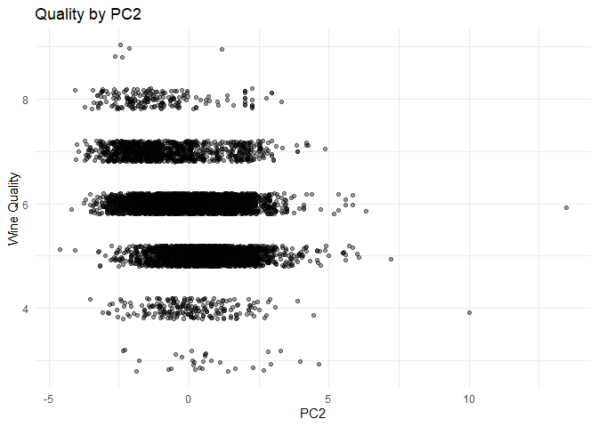

# Question 1

## Clustering

Using a K calculated by the first local max of the gap statistic (k=5)
we can cluster our data reasonable well with Kmeans++. Since the two
measures cluster difference that we are interested in are the color and
quality of the wine, we can look directly at how these clusters fall.

It’s easy to see the separation between Red and White wines here, since
the two colors are dominated by about half of the clusters. The
relationship between quality and cluster is less than clear

Looking at just the color classifications, clustering seems to be a
pretty reliable way to seperate wines

Important to note here is that we do not have even proportions of red
and white wine in our sample. The proportion of white wine is 0.75 so we
want to see the proportion be as far away from that midpoint as
possible.

Looking deeper into the quality of each cluster, we struggle to see much
difference between them at all.

The quality spread is much less reliable than the color. It is almost
impossible to distinguish between the quality based on the result of the
clustering.

## PCA

You can see very clearly from this graph that PC1 is a good measure of
wine color. PC2 is less related.

It is unsurprising that PC2 would be less related to wine color, since
PC1 draws a clear distinction and PC2 is calculated on the residuals of
PC1.

There is not a very clear relationship between PC and quality

Though weak, some limited trend does seem to appear on PC2 (and not on
PC1).

Investigating just PC2, the trend is not particularly clear. Note that
jitter is only applied on the Quality axis for clarity; PC2 values are
precise.

PC2 seems to be largely unrelated to quality ranking, but there may be
future PCs that show it more clearly

We can view the trends for a number of principle components to see that,
in addition to not being particularly clear on PC1 or 2, quality does
not seem to be distinguished on any principle component at all, even at
excessive numbers of components.

## Summary

The two summarization methods both perform exceptionally well when
distinguishing between red and white wine, and neither is a strong
performer at judging wine quality. The clustering method is likely the
better option here, even in absence of simply distinguishing red and
white wines. The chemical properties listed are all interrelated;
alcohol increases as residual sugar decreases during fermentation, while
the starting sugar is mainly determined by the grape type, but alcohol
will *also* change the acidity during fermentation, which is mainly
determined by vineyard and soil. These inter-relationships would limit
the areas of the space that are achievable and would limited the ability
of principle components to distinguish between wines since part of it’s
calculation would be simply capturing those relationships.

If we have additional factors we are trying to distinguish between (such
as grape type, vineyard location, etc.) then clustering would
intuitively give better distinctions, especially considering that wine
is made by bringing flavors within the batch close to a given family,
like Merlot or Chardonnay, so the wine creation process is analogous to
clustering by taste and would yield a less-continuous result, since
middle-ground wines are not often produced.

# Question 2

When investigating the tendencies of twitter users in association with a
brand, we can look at the principle components of their post counts to
get an idea of how they tend to intersect. There are four components
that provide decent insight, which each representing a larger contiguous
segment than the last. The scale of each component is in terms of
standard deviations from the mean, so a negative value means “less than
normal” and a larger value means “more than normal”. Below, we see each
of the top fifteen factors for each PC in order of magnitude.

<table>
<thead>
<tr>
<th style="text-align:left;">
Post Type
</th>
<th style="text-align:right;">
PC1
</th>
</tr>
</thead>
<tbody>
<tr>
<td style="text-align:left;">
religion
</td>
<td style="text-align:right;">
-0.2971000
</td>
</tr>
<tr>
<td style="text-align:left;">
food
</td>
<td style="text-align:right;">
-0.2969095
</td>
</tr>
<tr>
<td style="text-align:left;">
parenting
</td>
<td style="text-align:right;">
-0.2940041
</td>
</tr>
<tr>
<td style="text-align:left;">
sports\_fandom
</td>
<td style="text-align:right;">
-0.2877318
</td>
</tr>
<tr>
<td style="text-align:left;">
school
</td>
<td style="text-align:right;">
-0.2806379
</td>
</tr>
<tr>
<td style="text-align:left;">
family
</td>
<td style="text-align:right;">
-0.2442687
</td>
</tr>
<tr>
<td style="text-align:left;">
beauty
</td>
<td style="text-align:right;">
-0.2015184
</td>
</tr>
<tr>
<td style="text-align:left;">
crafts
</td>
<td style="text-align:right;">
-0.1936276
</td>
</tr>
<tr>
<td style="text-align:left;">
cooking
</td>
<td style="text-align:right;">
-0.1888085
</td>
</tr>
<tr>
<td style="text-align:left;">
fashion
</td>
<td style="text-align:right;">
-0.1838818
</td>
</tr>
</tbody>
</table>
<table>
<thead>
<tr>
<th style="text-align:left;">
Post Type
</th>
<th style="text-align:right;">
PC2
</th>
</tr>
</thead>
<tbody>
<tr>
<td style="text-align:left;">
sports\_fandom
</td>
<td style="text-align:right;">
-0.3169236
</td>
</tr>
<tr>
<td style="text-align:left;">
religion
</td>
<td style="text-align:right;">
-0.3161528
</td>
</tr>
<tr>
<td style="text-align:left;">
cooking
</td>
<td style="text-align:right;">
0.3142880
</td>
</tr>
<tr>
<td style="text-align:left;">
photo\_sharing
</td>
<td style="text-align:right;">
0.3030776
</td>
</tr>
<tr>
<td style="text-align:left;">
parenting
</td>
<td style="text-align:right;">
-0.2950822
</td>
</tr>
<tr>
<td style="text-align:left;">
fashion
</td>
<td style="text-align:right;">
0.2797997
</td>
</tr>
<tr>
<td style="text-align:left;">
food
</td>
<td style="text-align:right;">
-0.2378087
</td>
</tr>
<tr>
<td style="text-align:left;">
shopping
</td>
<td style="text-align:right;">
0.2098528
</td>
</tr>
<tr>
<td style="text-align:left;">
beauty
</td>
<td style="text-align:right;">
0.2086099
</td>
</tr>
<tr>
<td style="text-align:left;">
school
</td>
<td style="text-align:right;">
-0.1975724
</td>
</tr>
</tbody>
</table>
<table>
<thead>
<tr>
<th style="text-align:left;">
Post Type
</th>
<th style="text-align:right;">
PC3
</th>
</tr>
</thead>
<tbody>
<tr>
<td style="text-align:left;">
politics
</td>
<td style="text-align:right;">
-0.4899027
</td>
</tr>
<tr>
<td style="text-align:left;">
travel
</td>
<td style="text-align:right;">
-0.4242597
</td>
</tr>
<tr>
<td style="text-align:left;">
computers
</td>
<td style="text-align:right;">
-0.3670315
</td>
</tr>
<tr>
<td style="text-align:left;">
news
</td>
<td style="text-align:right;">
-0.3360356
</td>
</tr>
<tr>
<td style="text-align:left;">
health\_nutrition
</td>
<td style="text-align:right;">
0.2255148
</td>
</tr>
<tr>
<td style="text-align:left;">
personal\_fitness
</td>
<td style="text-align:right;">
0.2173747
</td>
</tr>
<tr>
<td style="text-align:left;">
cooking
</td>
<td style="text-align:right;">
0.1944997
</td>
</tr>
<tr>
<td style="text-align:left;">
automotive
</td>
<td style="text-align:right;">
-0.1908427
</td>
</tr>
<tr>
<td style="text-align:left;">
beauty
</td>
<td style="text-align:right;">
0.1507105
</td>
</tr>
<tr>
<td style="text-align:left;">
outdoors
</td>
<td style="text-align:right;">
0.1403903
</td>
</tr>
</tbody>
</table>
<table>
<thead>
<tr>
<th style="text-align:left;">
Post Type
</th>
<th style="text-align:right;">
PC4
</th>
</tr>
</thead>
<tbody>
<tr>
<td style="text-align:left;">
health\_nutrition
</td>
<td style="text-align:right;">
-0.4634666
</td>
</tr>
<tr>
<td style="text-align:left;">
personal\_fitness
</td>
<td style="text-align:right;">
-0.4444448
</td>
</tr>
<tr>
<td style="text-align:left;">
outdoors
</td>
<td style="text-align:right;">
-0.4147432
</td>
</tr>
<tr>
<td style="text-align:left;">
college\_uni
</td>
<td style="text-align:right;">
0.2555873
</td>
</tr>
<tr>
<td style="text-align:left;">
online\_gaming
</td>
<td style="text-align:right;">
0.2207630
</td>
</tr>
<tr>
<td style="text-align:left;">
politics
</td>
<td style="text-align:right;">
-0.1967260
</td>
</tr>
<tr>
<td style="text-align:left;">
news
</td>
<td style="text-align:right;">
-0.1768761
</td>
</tr>
<tr>
<td style="text-align:left;">
sports\_playing
</td>
<td style="text-align:right;">
0.1756699
</td>
</tr>
<tr>
<td style="text-align:left;">
photo\_sharing
</td>
<td style="text-align:right;">
0.1514910
</td>
</tr>
<tr>
<td style="text-align:left;">
beauty
</td>
<td style="text-align:right;">
0.1469076
</td>
</tr>
</tbody>
</table>

The first principle component represents the largest segment of users;
most significantly, they are all negatively signed. This means that the
most common thing the mass of users share in common are the things they
do not post. Given that, the first PC does not contain a huge amount of
information beyond the tendency of twitter users to make a lot of
self-similar posts. The second PC represents people who are interested
in fashion, photo sharing, cooking, health, and personal fitness but do
not tend to post religious, sports-related, or family-related posts.
This is conducive with active, single (or young) customers. The third PC
has a decent intersection, with the biggest difference being the very
negative inclusion of politics, travel, and computer related posts and
the small but positive inclusion of religious posts. If we, for a
moment, investigate just the mean and median of religious posts we can
see a (not scaled) mean of 1.095 and a median of 0. Given the sever
right skew, it is likely that this slight inclusion in the third
principle component represents a substantial preference toward religious
posts whereas other groups post *very* few, if any, religious tweets .
This amounts to two core groups of physically active, outdoors-focused
customers: one group that is socially focused (posting about beauty,
fashion, and sharing photos) who *may* be political while the other is
definitely not political, but is religious and more likely to have a
family, while also being slightly less concerned with popular culture.

The outlying group is represented by the fourth principal component:
they are notably less concerned with health and the outdoors than the
rest of the consumer base. Additionally, this group is probably college
aged (often posting about college), and interested in ‘typical’ college
topics: online gaming, sports playing, photo sharing, and beauty.

# Question 3

When it comes to the placement of items in a grocery store there are two
main questions: how should we, generally, organize out store so that
customers are able to shop easily and where should we break from that
rule to influence more purchases. This first question is one of raw
association: if you are buying things, we want to make sure that you
know where to buy it and are able to get as many things as possible near
to each other. The second question is more complicated; there are two
obvious paths: placing items that have a strong relationship with one
another even when they have no similar relationships and placing items
in such a way that you are more likely to buy that item given it’s new
placement than you were before. This first goal is achievable here and,
by selecting brands with higher profit margins than others, we can
increase revenue (i.e. putting name-brand cookies next to milk while all
other cookies are in the cookie aisle). The second question is *not* of
concern here, since that is a question of change in lift subject to
placements and outside the scope of our data.

For the first part: organization of stores. This is a question of
centrality given support and confidence of association rules. We are not
yet concerned with lift, just in associating items that appear together
often and organizing around those.

The staple foods are the unsurprising centers for this organization,
whole milk and a medley of vegetables show up near to each other, and
are closely related to breads and potatoes/carrots. On the further
wings, we have ice cream, yogurt, and tropical fruits gravitating toward
whole milk. Fruit juice bridges the gap between fruit, water, and soda,
all of which are closer to bread and vegetables than milk. These results
are somewhat unsurprising and closely mimic what you would find in any
grocery store.

Placing products to defy these conventions is a bit more interesting.
This is a question mainly of lift and confidence. In particular, we want
to meet a threshold for confidence that ensures our decisions matter
while seeking the highest possible lift.

Looking at these relationships, we can start to see some critical
associations. These are the high-lift associations across products and
the structure is somewhat interesting. There are a handful of key
families that draw paths that can be intuited, such as canned fish being
related to mayonnaise (two key ingredients for tuna salad and not for
much else) and mayonnaise being closely associated to ketchup, both of
which are important for hamburgers. Finally, both of these close pairs
are pretty strongly associated with dish cleaner for obvious reasons.

Beyond this core of highly-cross associated chunks, there are ‘islands’
that represent pairs that don’t associated with anything else.
Beer/wine/liquor and pretzels/nuts/salty snacks are two islands like
this, which represent items that are normally bought in variety and not
often paired with much else. If we just list the top few rules, we can
see the most valuable items to put together.

<table>
<thead>
<tr>
<th style="text-align:left;">
First Item
</th>
<th style="text-align:left;">
Second Item
</th>
<th style="text-align:right;">
Lift
</th>
<th style="text-align:right;">
Count
</th>
</tr>
</thead>
<tbody>
<tr>
<td style="text-align:left;">
{cleaner}
</td>
<td style="text-align:left;">
{abrasive cleaner}
</td>
<td style="text-align:right;">
28.10
</td>
<td style="text-align:right;">
5
</td>
</tr>
<tr>
<td style="text-align:left;">
{pickled vegetables}
</td>
<td style="text-align:left;">
{specialty vegetables}
</td>
<td style="text-align:right;">
16.44
</td>
<td style="text-align:right;">
5
</td>
</tr>
<tr>
<td style="text-align:left;">
{female sanitary products}
</td>
<td style="text-align:left;">
{cleaner}
</td>
<td style="text-align:right;">
16.39
</td>
<td style="text-align:right;">
5
</td>
</tr>
<tr>
<td style="text-align:left;">
{baking powder}
</td>
<td style="text-align:left;">
{cooking chocolate}
</td>
<td style="text-align:right;">
15.83
</td>
<td style="text-align:right;">
7
</td>
</tr>
<tr>
<td style="text-align:left;">
{mustard}
</td>
<td style="text-align:left;">
{ketchup}
</td>
<td style="text-align:right;">
13.89
</td>
<td style="text-align:right;">
7
</td>
</tr>
<tr>
<td style="text-align:left;">
{mustard}
</td>
<td style="text-align:left;">
{mayonnaise}
</td>
<td style="text-align:right;">
12.97
</td>
<td style="text-align:right;">
14
</td>
</tr>
<tr>
<td style="text-align:left;">
{hamburger meat}
</td>
<td style="text-align:left;">
{Instant food products}
</td>
<td style="text-align:right;">
11.42
</td>
<td style="text-align:right;">
30
</td>
</tr>
<tr>
<td style="text-align:left;">
{canned fish}
</td>
<td style="text-align:left;">
{meat spreads}
</td>
<td style="text-align:right;">
11.08
</td>
<td style="text-align:right;">
7
</td>
</tr>
<tr>
<td style="text-align:left;">
{detergent}
</td>
<td style="text-align:left;">
{softener}
</td>
<td style="text-align:right;">
10.60
</td>
<td style="text-align:right;">
11
</td>
</tr>
<tr>
<td style="text-align:left;">
{red/blush wine}
</td>
<td style="text-align:left;">
{liquor}
</td>
<td style="text-align:right;">
10.03
</td>
<td style="text-align:right;">
21
</td>
</tr>
<tr>
<td style="text-align:left;">
{pet care}
</td>
<td style="text-align:left;">
{sauces}
</td>
<td style="text-align:right;">
9.79
</td>
<td style="text-align:right;">
5
</td>
</tr>
<tr>
<td style="text-align:left;">
{cling film/bags}
</td>
<td style="text-align:left;">
{house keeping products}
</td>
<td style="text-align:right;">
9.64
</td>
<td style="text-align:right;">
9
</td>
</tr>
<tr>
<td style="text-align:left;">
{butter}
</td>
<td style="text-align:left;">
{rubbing alcohol}
</td>
<td style="text-align:right;">
9.02
</td>
<td style="text-align:right;">
5
</td>
</tr>
<tr>
<td style="text-align:left;">
{canned vegetables}
</td>
<td style="text-align:left;">
{specialty cheese}
</td>
<td style="text-align:right;">
8.84
</td>
<td style="text-align:right;">
8
</td>
</tr>
<tr>
<td style="text-align:left;">
{salt}
</td>
<td style="text-align:left;">
{jam}
</td>
<td style="text-align:right;">
8.75
</td>
<td style="text-align:right;">
5
</td>
</tr>
</tbody>
</table>

This gives a good idea of the strongest associations across the data in
terms of lift. Cleaners and abrasive cleaners are a good example of
items that would intuitively be grouped, since they are *only* bought
together whereas the association between cheese and canned vegetables is
possibly less obvious unless you are a frequent consumer of charcuterie
boards.
